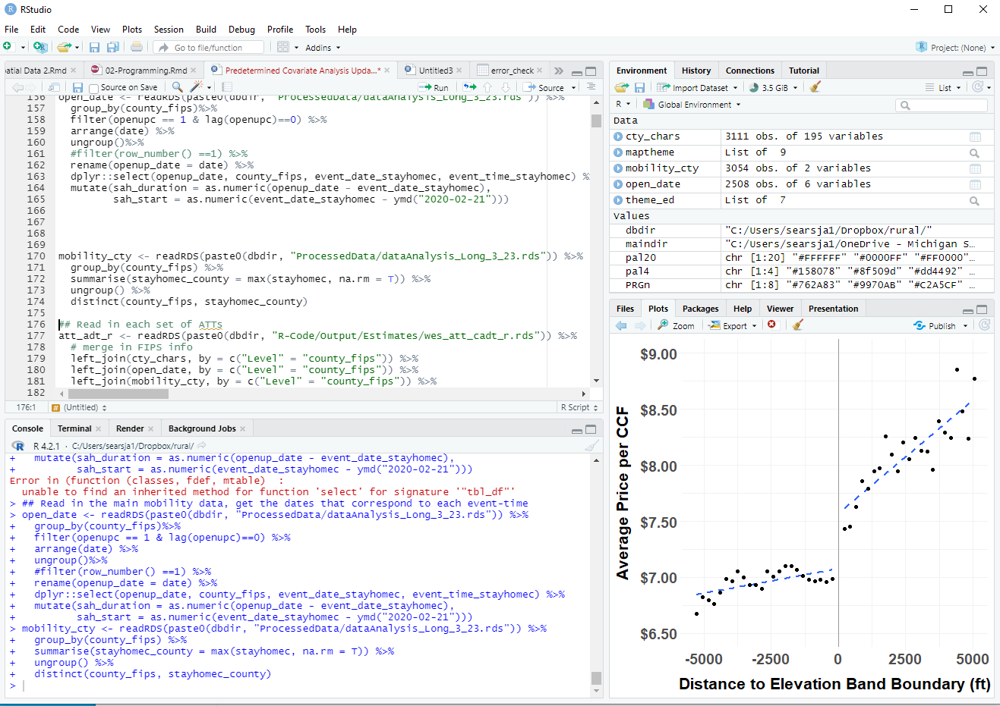
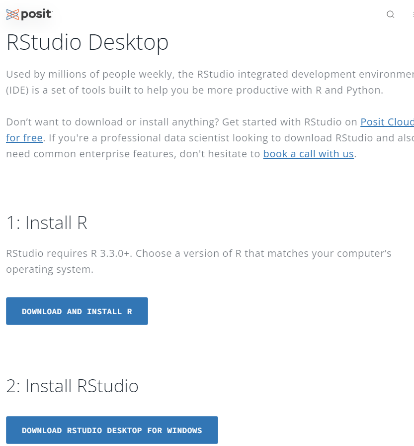
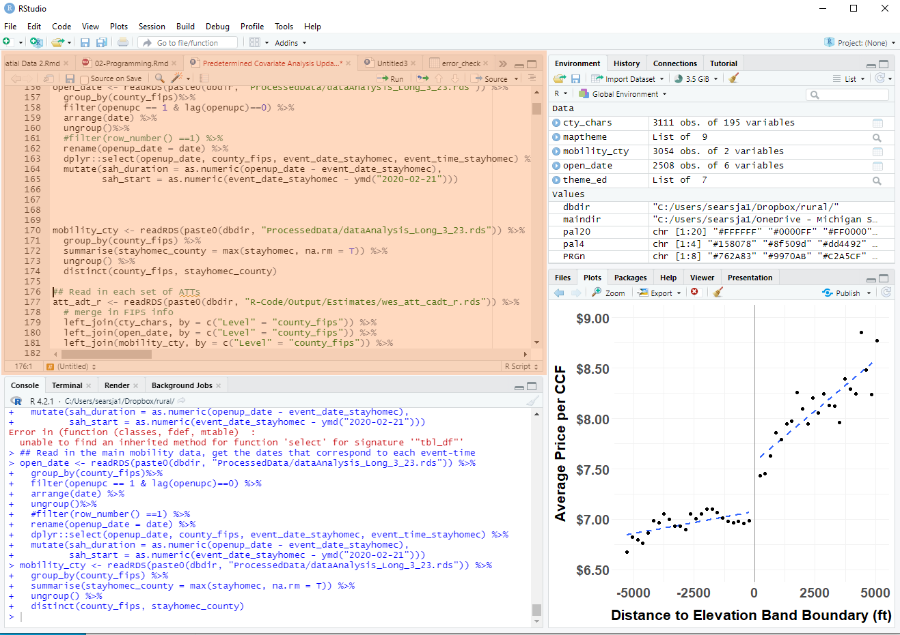
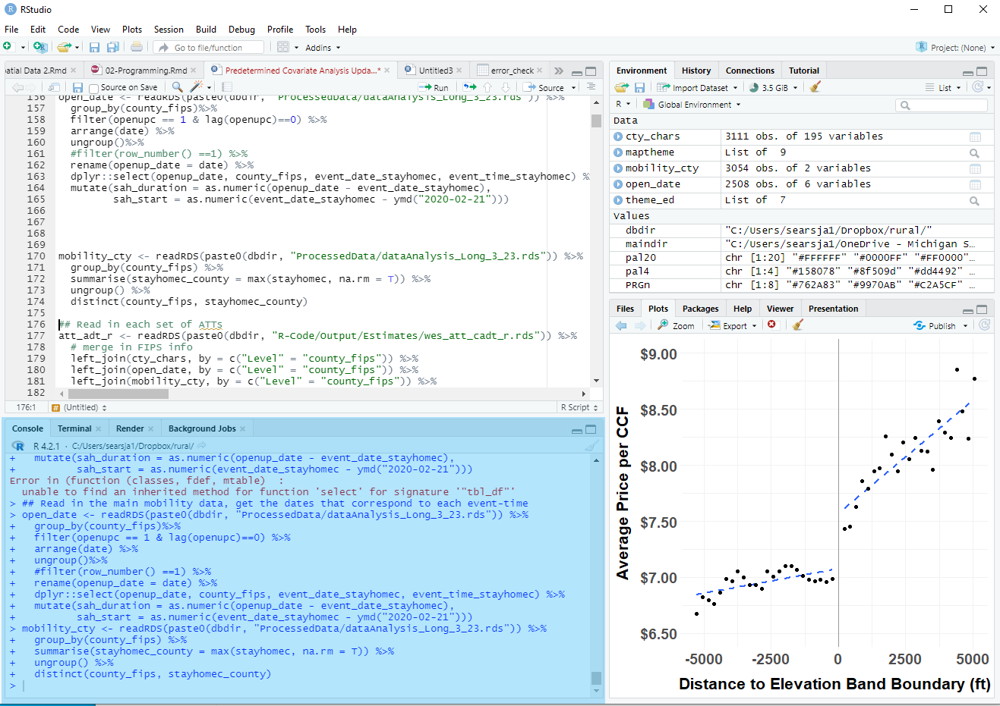
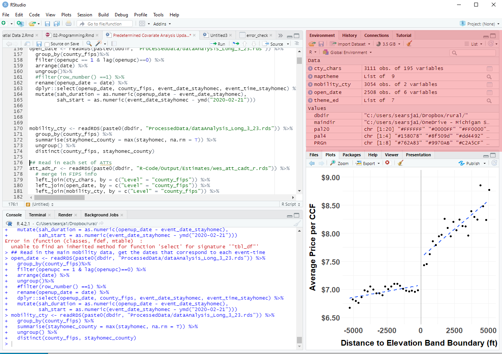
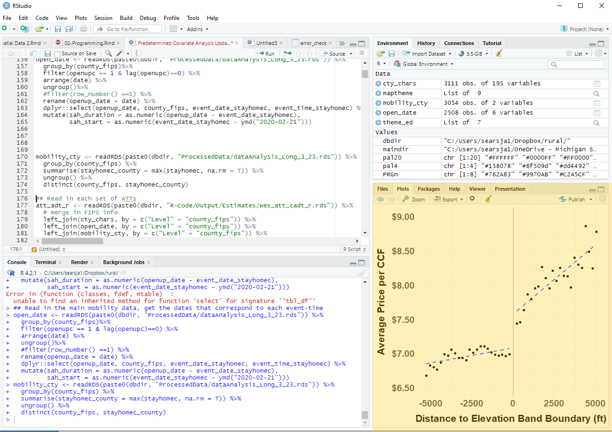

```{css, echo=FALSE}
# CSS for including pauses in printed PDF output (see bottom of lecture)
@media print {
  .has-continuation {
    display: block !important;
  }
}
.remark-code-line {
  font-size: 95%;
}
.small {
  font-size: 75%;
}
.scroll-output-full {
  height: 90%;
  overflow-y: scroll;
}
.scroll-output-75 {
  height: 75%;
  overflow-y: scroll;
}
```

```{r setup, include=FALSE}
options(htmltools.dir.version = FALSE)
library(knitr)
library(fontawesome)
knitr::opts_chunk$set(
	fig.align = "center",
	cache = FALSE,
	dpi = 300,
  warning = F,
  message = F,
	fig.height = 5,
	out.width = "80%"
)
```
# Table of Contents

1. [Course Introduction](#intro)

1. [R and RStudio](#about)

1. [Basic R Operators](#operators)

1. [Objects and Functions](#objects)

1. [Packages, Libraries, and Paths](#paths)

1. [Interacting with and Manipulating Data Frames](#df)


---
class: inverse, middle
name:slides

# Reading/Using the Slides

---
# Reading the Slides

As you'll soon see, I frequently use .hi-medgrn[color to emphasize text].

--

One distinction: .hi-orange.under[Links]
  * .hi-orange.under[Underlined orange] is reserved for .hi-orange.under[links]
  * Whenever you see .hi-orange.under[underlined orange text] on other slides, click it to go to the referenced content

---
# Using the Slides

I highly recommend that you [replicate code in the slides as I go](https://github.com/afre-msu/AFRE-891-991-SS25/tree/033f59f18cee67d3363cc98229dfb86a649eb838/Lecture%20Slides/01-R-Intro).super[.pink[†]].
  * Try to type the code yourself first, use the code written in slides if you fall behind
  * Good habit to create a .hi-blue[reference script] with all the new methods/functions as you go

.footnote[
.pink[†] A wild link appears. Click it!
]

--

These slides are written in .hi-slate[R Markdown], which we'll cover next week.
  * Slides are rendered as a standalone .hi-blue[web page (.html)] or .hi-purple[pdf file]
  * Source code as an interactive .hi-medgrn[R Markdown file (.Rmd)]

  
---
class: inverse, middle
name: intro

# Course Introduction

---
# Introductions

.pull-left[
### Me

`r fa('address-book')` [James Sears](https://jamessea.rs/)

`r fa('envelope')` [searsja1@msu.edu](mailto:searsja1@msu.edu)

`r fa('graduation-cap')` Assistant Professor (environmental and consumer behavioral economics)
]

--

.pull-right[
### You

A quick roundtable of 

* Names
* Program/year
* Fields/interests
* Coding Background
]


---
class: inverse, middle
# Syllabus Highlights

(Read the whole thing here: [891](https://github.com/afre-msu/AFRE-891-991-SS25/blob/98c476e6dcc6128e282332c5208152fcfaa46d90/Course%20Logistics/AFRE%20891/Syllabus%20-%20AFRE%20891%20SS25.pdf), [991](https://github.com/afre-msu/AFRE-891-991-SS25/blob/98c476e6dcc6128e282332c5208152fcfaa46d90/Course%20Logistics/AFRE%20991/Syllabus%20-%20AFRE%20991%20SS25.pdf))

---
# Why This Course(s)?

Because a huge chunk of what's important for doing modern (high-quality) empirical economic research .hi-medgrn[isn't taught in core classes].

  * How to find, clean, and wrangle datasets
  * Working with spatial data
  * Creating professional-quality data visualizations
  * Recent empirical methods outside the scope of core econometrics
  * Fundamentals of data science

--

In short: these are the skills that will .hi-blue[increase your research productivity] and expand your opportunities while on the .hi-pink[job market].

--

In shorter: these are the .hi-purple[skills I wish I had] going into my original research work.

---
# Grading

| Component                           | Weight |
|:-|-:|
| 6 × .hi-medgrn[Homework Assignments] (13.33% each) | 80% |
| .hi-purple[Final Project] | 20% |

  * .hi-medgrn[Homework assignments] focus on coding practice through applied practice, replication, simulation, and/or extension
    * Contents are differentiated according to your enrolled course version
  * .hi-purple[Final project] relates to applying course methods + research supply chain
    * Different specifics for 891/991

---
# Final Project: 891

The final project for students enrolled in 891 has .hi-pink[two options]:

--


.pull-left[
.center[.hi-medgrn[Replication]]

  * Identify a paper you are interested in replicating that aligns with our covered course content - and replicate it!
  * Create an RMarkdown file that you can hand to a fellow student that fully walks through the replication process
]

--


.pull-right[
.center[.hi-purple[Data Acquisition]]

  * Identify a data source that's not in directly machine-readable format (i.e. `dta, rds, csv`, etc.)
  * Use the course's data acquisition techniques (web scraping, APIs) to construct the dataset
  * Create an RMarkdown file that documents the process and executes all code needed to obtain the dataset
]


  
---
# Final Project: 891

.more-left.font90[
Both project types involve
  
  1. .hi-slate[Project Proposal]: brief summary of the paper you have selected and why, and how the replication package is organized (before Spring Break)
  1. .hi-slate[Material Submission]: Fully documented R Markdown file walking through full replication process or conducting data acquisition (Week 15)
  1. .hi-slate[Presentation]: 8-10 minute conference-style presentation sharing what you did with fellow students (Finals Week)
  1. .hi-slate[Discussant]: work through assigned student's material submission and prepare 3 minute presentation on your experience (Finals Week)
]

--
.less-right[
Grading:

| Component                           | Weight |
|:-|-:|
| Proposal 	| 3% |
| Material Submission 	| 7% |
| Presentation 	| 7% |
| Discussant				        | 3% |
  ]
  
---
# Final Project: 991

The final project for 991 is a .hi-blue[research project] that relates to course methods + your planned research portfolio
    
  * Creation of new dataset using course data acquisition techniques
  * Replication + extension of existing paper (using course methods)
  * Use course methods to tackle desired research question
 
---
# Final Project: 991
.more-left[
.font90[
Project deliverables include

  1. .hi-slate[Project Prospectus]: one-page prospectus outlining the proposed project and planned direction (before Spring Break)
  1. .hi-slate[Replication Package]: Fully replication package containing all necessary data/code and documentation needed to replicate your project (Week 15)
  1. .hi-slate[Presentation]: 8-10 minute conference-style presentation summarizing your project (Finals Week)
  1. .hi-slate[Discussant]: work through assigned student's replication package and prepare 3 minute presentation on how it went/any issues (Finals Week)
  ]
]

--

.less-right[

Grading:

| Component                           | Weight |
|:-|-:|
| Prospectus 	| 3% |
| Replication Package 	| 7% |
| Presentation 	| 7% |
| Discussant				        | 3% |
]


---
# Course Schedule (I)
.pull-left[
### Intro to Data Science (Weeks 1-2)
  * Introduction and R Basics
  * Version control with Git(hub) and Productivity Tools
  
### Data Processing (Weeks 3-5)
  * Data Wrangling
  * Data Cleaning
]

.pull-right[
### Data Visualization (Week 6)
  * Principles of Data Visualization
  * Common Chart Types
  * Custom Themes and Extending `ggplot2`
]
---
# Course Schedule (II)

.pull-left[
### Data Acquisition (Weeks 7, 9A).super[.pink[†]]
  * Finding and Acquiring Data
  * Considerations for Administrative or PII Data
  * Scraping Static Webpages
  * Scraping Dynamic Webpages
  * Respectful Web Scraping
]

.pull-right[
### Programming (Weeks 9B-10)
  * Conditional Logic
  * Function writing
  * Indirection and Name Injection
  * Vectorization
  * Parallelization 
]

.footnote[
.pink[†] Week 8 is Spring Break!
]

---
# Course Schedule (III)

.pull-left[
### Analysis (Weeks 11-12A)
  * Fast Fixed Effects Regression and IV Analysis
  * Causal Inference: Diff-in-Diff and Event Study Methods
  * Synthetic Control Methods (canonical, synthetic DiD, Partially Pooled SCM)
  * Producing Tables and Figures from Regression Output
]

.pull-right[
### Spatial Analysis (Weeks 12B-13)
  * Intro to Geospatial Data
  * Vector Data and Spatial Operations
  * Raster Data and Integration
  * Static and Interactive Mapping
]

---
# Course Schedule (IV)

### Machine Learning (Weeks 14-15)
  * Fundamentals of Machine Learning
  * Prediction Methods
  * Classification Methods
  * Model Selection and Regularization
  * Regression Trees and Forest-Based Methods
  * Machine Learning for Causal Inference


---
class: inverse, middle
name: about

# About R and RStudio

---

#	Why Are We Using R in This Course?

-	It’s free and open source

- It’s widely used in industry

- It’s widely used in academic research

- It has a large and active user community

--

</br>
**Compared with Stata:**

- More of a true programming language

- Steeper learning curve (takes more to start, ultimately more powerful)

- Faster for fixed effects models (often much faster)

- Many methods come to R earlier


---

# R vs. Python
.pull-left[ 
 .hi-medgrn[R:]
- Built for statistics and data analysis
- Better at econometrics and data visualization
]

--

.pull-right[
.hi-purple[Python:]
- Built for general-purpose programming and software development
- Better at machine learning
]

```{r, out.width="60%", echo=F}
include_graphics("images/r_vs_python.png")
```
.small.center[Image by Alex daSilva ([source](https://towardsdatascience.com/r-vs-python-comparing-data-science-job-postings-seeking-r-or-python-specialists-2c39ba36d471)) is not included under the CC license.]

---

# R vs. Python
.pull-left[ .hi-medgrn[R:]
- Built for statistics and data analysis
- Better at econometrics and data visualization
]


.pull-right[
.hi-purple[Python:]
- Built for general-purpose programming and software development
- Better at machine learning
]

Most economists use **either** .hi-blue[Stata] **or** .hi-medgrn[R]

Many data scientists in industry use **both** .hi-medgrn[R] **and** .hi-purple[Python]

Rising competitor to both: .hi-green[Julia]

---

# R Is a Means, Not an End

- The goals of this course are .hi-dkgrn[platform-agnostic]
  *	It’s not about the syntax of specific packages
  *	It’s about the concepts, logic, and thought processes underlying what we're doing and why

- Your eventual goal: .hi-purple[use the right tool for the job]
  * From this course, you'll have a good sense of whether .hi-medgrn[R] is the right tool
  * Or how to figure out if it is


---
# R and Myself


- Personally, I use .hi-medgrn[R almost exclusively] because it gives me .hi-purple[one environment] for all steps of the research workflow

  * Cleaning/manipulating large datasets
  * Spatial data
  * Visualization
  * Econometric analysis
  * Web scraping
  * Machine learning

--

- While it might not be .hi-blue[the best] at all of these tasks, it's almost always .hi-medgrn[one of the best]
- Using different software for each task makes .hi-purple[reproducibility more difficult]

---
# R and You

- Many of you will .hi-slate[know more than me] about these things! Please speak up and share if you

  *	Find an error in the code/discussion
  * Know a better way of doing things
  * Have suggestions on improving the course
  
--

This is also the first implementation of concurrent course versions; I would love .hi-dkgrn[any and all feedback] as we go!


---
class: inverse, middle
name: rstudio

# R and RStudio

---
# R vs. RStudio

- .hi-medgrn[R] is the .hi-dkgrn[programming language]

- .hi-blue[RStudio] is the .hi-purple[environment] in which we use .hi-medgrn[R] 

--

- While we could use .hi-medgrn[R] without .hi-blue[RStudio], .hi-blue[RStudio] offers a lot of benefits


---
# Installing R

To install .hi-medgrn[R], go to the [R Project website](https://ftp.osuosl.org/pub/cran/).

- **Windows:** "R For Windows > Base > Download R # for Windows" 
 
- **Mac:** "R for (Mac) OS X > R-#.pkg"

- Where "#" is the current version number


 


---

# RStudio
.pull-left-sm[

.hi-blue[RStudio] has a lot of features to make programming in .hi-medgrn[R] **more user friendly**
  * Create and edit scripts
  * View output and visualizations
  * Navigate file structures
  * See objects in memory
  
]
.pull-right-lg[

 

]

---

# Installing RStudio

To install .hi-blue[RStudio], go to the [RStudio Download Page](https://posit.co/download/rstudio-desktop/#download)
.pull-left-sm[
- Scroll down, follow the link to install RStudio for your operating system. 
- Correct file should be linked under **2. Install RStudio**
- Can scroll further down to the entire list and download the version for Windows or Mac. 
 ]
 .pull-right-lg[
 
]

---
# Other Things

* Create an account on [GitHub](https://github.com/) and register for a [student/educator  discount](https://education.github.com/discount_requests/new)
    * You will soon receive an invitation to the course repo on GitHub, as well as [GitHub classroom](https://classroom.github.com), which is how we'll disseminate and submit assignments, receive feedback and grading, etc. 
- **Windows:** Install [Rtools](https://cran.r-project.org/bin/windows/Rtools/)
- **Mac:** Configure/open your C++ toolchain (see [here](https://github.com/rmacoslib/r-macos-rtools#installer-package-for-macos-r-toolchain-)

---
# RStudio
.pull-left-sm[

.hi-blue[RStudio] has  **four main elements**
  1. Script Window
  1. Console
  1. Environment
  1. Files/Plots/Packages/Help Window
  
]
.pull-right-lg[

 

]

---
# Getting Around RStudio: Script Window
.hi-purple[Scripts] are the .hi-medgrn[**do file equivalent**] in .hi-medgrn[R]:
  - Allow you to .hi-purple[write and save code], flip through multiple scripts/objects

 


---

# Getting Around RStudio: Console
.hi-blue[Console] is the .hi-medgrn[**direct R interface**]

  - View output or plug in code directly (use scripts!)

 


---

# Getting Around RStudio: Environment
.hi-turquoise[Environment] shows you .hi-medgrn[**everything currently loaded in R**]
  - Datasets, matrices, strings, functions, and other .hi-turquoise[objects]

 


---
# Getting Around RStudio: Files/Plots
.pull-left-sm[
.hi-slate[Files/Plots/Packages/Help] shows you... .hi-medgrn[**everything else**]
  - .hi-slate[Files] navigate file paths
  - .hi-slate[Plots] view data visualizations
  - .hi-slate[Packages] load/see packages
  - .hi-slate[Help] get help with function syntax]
  .pull-right-lg[
 
]

---
# Getting to Know RStudio

1. **Try out the console**
  * Use it as a calculator
  * Access previous commands

1. **Try a new script and save it**

1. **Set global options (Tools -> Options)**
  * Uncheck .hi-green["Restore .RData into workspace at start"]
  * Set .hi-green["Save workspace to .RData on exit"] to .hi-medgrn["Never"]

1. **Keyboard shortcuts**

---

# Time for Some Live Coding

Open a .hi-medgrn[new R script.]

As we go through examples, **retype everything yourself and run it line by line** (`Ctrl+Enter`)<sup>1</sup>. You'll learn more this way.

(Feel free to try out slight tweaks along the way, too.)

.footnote[
.super[1] For Mac users: `Cmd` = `Ctrl`. You can also use the `Run` button on the upper-right of the Script window to run code or view shortcuts.
]
---
class: inverse, middle
name: operators

# Basic R Operators

---
# Basic Arithmetic

You can use .hi-medgrn[R] like a .hi-purple[fancy, low-portability graphing calculator:]
```{r}
1 + 2 - 3  # Addition/Subtraction
5 / 2  # Division
4 * 3  # Multiplication
2 ^ 3  # Exponentiation
```

---
# Remember PEMDAS?
Parentheses .hi-medgrn[matter]!

```{r}
2 + 4 * 1 ^ 3 
(2 + 4 * 1) ^ 3 
2 + (4 * 1) ^ 3 

```
--

What feels like 95% of my coding errors are due to **unmatched parentheses**

This gets even more important as we use nested functions
---
# Logical Evaluation

.hi-dkgrn[Logical operators] follow .hi-medgrn[standard programming conventions]:

```{r}
1 == 2 # == for equivalency (two equal signs)
1 > 2 # < and > work as expected
1 > 2 & 0.5 < 0.5 # The "&" means "and"
1 > 2 | 1 > 0.5 # The "|" means "or"
```
---
# Negating Logic

.hi-blue[Negate] logical comparisons with .hi-medgrn[`!` and parentheses]

```{r}
1 != 2 # ! and = next to each other for neq
!(1 > 2) # add parentheses around the condition you want to negate
!(1 > 2 & 0.5 < 0.5) # can negate complex conditions
!(1 > 2) | !(1 > 0.5) # or combine with other logical operators
```
---
# Errors

What if we accidentally used .hi-medgrn[`=`] instead of .hi-medgrn[`==`]?
  - `=` is reserved for .hi-medgrn[assignment]
  - `==` is reserved for .hi-pink[equivalence]

```{r, error=T}
1 = 1
```

--


What should you do if you don't understand the error message?
  - .hi-purple[Always read the error message!]
  
---
# Commenting
Another good practice is to .hi-dkgrn[comment code]

  - Use the .hi-medgrn[pound sign `#`] to comment out everything behind it on a given line.


```{r}
# Use it at the start of a line to add comments
4 > 3

# or to comment out parts of lines
4 + 5 - 23 # * 6798127347^38 yikes that would've been big
```


---
# Commenting
Another good practice is to .hi-dkgrn[comment code]

.hi-medgrn[Widely accepted conventions:]
- Put the comment **before** the code it refers to
- Use present tense

---
# Script Chunks
You can use .hi-medgrn[`# ----`] or .hi-medgrn[`#####`] to add .hi-blue[collapsible chunks] to your scripts

```{r}
# Use it Break up tasks (can put text in the middle) ----
4 > 3

##### 
# or separate preamble from different sections
```

Click the .hi-medgrn[downward triangle] (left next to the line numbers) to .hi-purple[hide the lines between breaks]


---
class: inverse, middle
name: objects

# Objects
---
# Objects

.hi-medgrn[R] is an example of .hi-purple[[object-oriented programming (OOP)](https://en.wikipedia.org/wiki/Object-oriented_programming)  ]

--

* Everything is an .hi-blue[object]
* Everything has a .hi-turquoise[name]
* You do things with .hi-blue[functions]
* Functions come pre-written in .hi-pink[packages (i.e. "libraries")]
* You can (and should) .hi-green[write your own functions too]

--

Understanding .hi-blue[objects] is the first key to using .hi-medgrn[R].


---
# Objects

We can store values for later by assigning them to .hi-dkgrn[objects.]

--

We assign using one of two .hi-medgrn[assignment operators:]
  * `<-` (the `<` followed by `-`),
  * or `=`

```{r}
price <- 149.99
tax <- 0.085
```

Here price "gets" the value `149.99`.

---
# Choice of Assignment Operator
Why use `<-` instead of `=`? 

Well, it turns out that it's a [lot more complicated of a question than it appears (warning: pedantic rabbit hole )](https://stackoverflow.com/questions/1741820/what-are-the-differences-between-and-assignment-operators)

--

**My recommendation:**
  * Use `<-` to .hi-medgrn[assign objects to memory]
  * Use `=` for .hi-purple[declaring function arguments]
  
--

**Another reason:** Google asks their developers to assign objects with `<-` in the [Google RGuide](https://google.github.io/styleguide/Rguide.html), so if it's good enough for Google it's good enough for me.
  

---
# Objects

To see the value of an object, just .hi-medgrn[type its name:]
```{r}
price
```

Notice that `price` and `tax` are now listed in your .hi-medgrn[Environment pane].

Now, we can calculate the sales tax:
```{r}
price * tax
```


---
# Objects


We can assign a new value to `price` and recalculate the tax amount:
```{r}
price = 90
price * tax
```

--

Note that object names are .hi-purple[case sensitive:]

```{r}
Price = 99.99
PRICE = 9.99
sales.tax = 0.05
sales_tax = 0.075
```

--

```{r}
Price * sales.tax
```


---
# Object Names

Rules for naming objects:
* Names can include numbers
* Names can include periods `.` and underscores `_`
* Names .hi-purple[must start with a letter]


```{r, error = TRUE}
sales_tax <- 0.075
10tax  <- 0.1
```


---
# Types of Objects

We'll see throughout the course that there are many types of objects in .hi-medgrn[R], including

.pull-left[ 
- .hi-purple[Single values] (numbers, characters; like `price`)
- .hi-purple[Vectors]
- .hi-purple[Matrices]
- .hi-purple[Data frames]
]
.pull-right[
- .hi-purple[Arrays]
- .hi-purple[Factors]
- .hi-purple[Lists]
]

--

We'll dive into many of these in-depth during this course, but let's take a quick look at each

---
# Vectors

A .hi-medgrn[vector] is an .hi-medgrn[ordered collection of numbers or character strings] indexed by 1, 2, …, n, where n is the length of the vector.


```{r, error = TRUE}
# for ordered integers, can use :
int_1_10 <- 1:10

# or the combine operator to manually combine elements
c(11, 13, 14, 200)
```

---
# Vectors

Other useful ways to create non-sequential vectors include

Creating a sequence with `seq()`

``` {r}
seq(0, 10, by = 2)
```

--

Repeating elements with `rep()`

``` {r} 
rep(1, 5)

rep(c(1,2,3), 2)
```

---
# Vectors

A vector with both numeric and text entries .hi-medgrn[converts everything to text:]

``` {r}
c(7, "Michigan", 19, "State")
```


---
# Vectors

You can .hi-blue[name elements] in a vector (with or without quotations)

``` {r}
state_founding <- c(MI = 1837, IN = 1816, IL = 1818)
state_founding
state_founding == c("MI" = 1837, "IN" = 1816," IL" = 1818)
```

--

Or by using the `names()` function

``` {r}
state_founding <- c(1837, 1816, 1818)
states <- c("MI", "IN", "IL")
names(state_founding) <- states
```


---
# Matrices

A .hi-medgrn[matrix] is... well, a matrix.
 * A .hi-medgrn[two-dimensional collection] of numeric or character values indexed by integer pairs (i,j)
 
``` {r}
xmat <- matrix(c(1,2,3,4,5,6),
            ncol = 3,
            nrow = 2)
xmat
```

---
# Matrices

Fill .hi-blue[across columns] instead by setting `byrow = FALSE`
 
``` {r}
matrix(c(1,2,3,4,5,6),
            ncol = 3,
            nrow = 2,
       byrow = FALSE) #<<
```

---
# Matrices
 Combine matrices on the rows with `rbind()`
  * Must have matching number of columns
 
``` {r}
ymat <- matrix(c(7,8,9),
            ncol = 3,
            nrow = 1)

rbind(xmat, ymat)
```

---
# Matrices
 Combine matrices on the columns with `cbind()` 
  * Must have matching number of rows
 
``` {r}
zmat <- matrix(c(7,8,9,10,11,12,13,14),
            ncol = 4,
            nrow = 2)

cbind(xmat, zmat)
```

---
# Arithmetic with Vectors and Matrices

Arithmetic operators apply .hi-blue[element-wise] to vectors and matrices.

``` {r}
vec1 <- 1:4
vec2 <- 11:14
vec1 + vec2
```


---
# Arithmetic with Vectors and Matrices

Arithmetic operators apply .hi-blue[element-wise] to vectors and matrices.

``` {r}
mat1 <- matrix(2:7, nrow = 2)
mat2 <- matrix(seq(4,14, by = 2), nrow = 2)
mat2/mat1
```

---
# Arithmetic with Vectors and Matrices

To perform .hi-medgrn[matrix multiplication], use `%*%`
  * Remember rules for dimensions! 


``` {r}
mat1 <- matrix(2:7, nrow = 2) # 2 x 3 matrix
mat3 <- matrix(seq(4,14, by = 2), nrow = 3) # 3 x 2 matrix
mat1 %*% mat3 # results in 2x2 matrix
```

---
# Data Frames

.hi-purple[data frames] are the data science version of a matrix
  * Each .hi-medgrn[column] is a .hi-medgrn[variable]
  * Each .hi-blue[row] is an .hi-blue[observation]
  * Variables can have .hi-dkgrn[names] 
  * Columns can be of .hi-pink[different types]
  * Should sound familiar to Stata folks
  
```{r}
ex_df <- data.frame(state = c("MI", "IN", "WI", "IL"),
                    pop_m = c(10.04, 8.87, 5.91, 12.55),
                    is_michigan = c(T, F, F, F))
ex_df
```


---
# Accessing Element(s)

We can access specific element(s) of vectors with their .hi-medgrn[integer position] and .hi-medgrn[brackets] `[]`

``` {r}
# get the first element of int_1_10
int_1_10[1]

# get the third and fourth elements
int_1_10[3:4]
```


---
# Accessing Element(s)

We can do the .hi-blue[same with matrices and data frames], as well as access entire rows/columns

``` {r}
# retrieve the third and fourth columns elements of row two in zmat:
zmat[2,3:4]

# Replace the entire second row of ex_df with Pennsylvania:
ex_df[2,] <- c("PA", 8.24, FALSE)

# take the sum of elements in the third and fourth columns of zmat:
sum(zmat[,3:4])
```


---
# Accessing Element(s)

If an object has names, you can also index using those!

``` {r}
state_founding["MI"]
ex_df["pop_m"]
```

---
# Accessing Element(s)

We can access .hi-medgrn[entire columns] in .hi-purple[dataframes] with `$`

  * Can combine it with indexing (`[]`) too!
  
```{r}
# get the "pop_m" column from ex_df:
ex_df$pop_m

# which is equivalent to using integer indexing
ex_df[,2]

# combine with indexing to get third row element of "state"
ex_df$state[3]
```

---
# Arrays

.hi-dkgrn[Arrays] are .hi-dkgrn[n-dimensional collections] of numeric/text elements, indexed by an n-tuple of integers - i.e. (i,j,k) for 3-dimensional array

``` {r}
ar4 <- array(1:24, dim = c(2,2,2,3))
ar4
```
---
# Arrays
Just like with matrices, we can use integer indexing to retrieve specific element(s) from an array

``` {r}
# get first element
ar4[1,1,1,1]

# get 2x2 matrix in "last" position 
# (2/2 in third dimension, 3/3 in fourth)
ar4[,,2,3]
```


---
# Factors

A .hi-purple[factor] is a special kind of vector, where each element has an associated .hi-purple[level (i.e. character label)]
  * Useful for storing categorical variables
  * R will treat each level distinctly
  
``` {r}
edu <- factor(c("bach", "hs", "some_col", "phd", "bach", "hs"),
                     # specify the order
         levels = c("hs", "some_col", "bach", "phd"),
         # specify the text labels
         labels = c("High School", "Some College",
                    "Bachelors", "Doctorate"))
edu
```

---
# Lists

.hi-slate[Lists] are an .hi-slate[ordered collection of objects] (that may be of different types)

``` {r}
# combine many of our previous objects into a list
ex_list <- list(
  ex_df,
  int_1_10,
  xmat
)
ex_list
```

---
# Lists

List objects are indexed with .hi-medgrn[double brackets `[[]]`]

``` {r}
# get the second list object (the vector)
ex_list[[2]]
```


---
# Lists

You can also .hi-purple[name list objects] and reference them with `$`

``` {r}
# combine many of our previous objects into a list
ex_list <- list(
  df = ex_df,
  vec = int_1_10,
  mat = xmat
)
ex_list$vec
```

---
# Checking Object Types 

Unsure what type an object is? Use `class()` to check:

```{r}
class(ex_list)

class(zmat)

class(ex_df)
```

---
# Converting Types

Use the `as.type()` group of functions to .hi-blue[convert between types]

``` {r}
num <- 1:4
char <- as.character(num)
char
as.numeric(char)
```

---
# NA

If a conversion .hi-green[isn't obvious], you'll get an .hi-pink[NA]

``` {r, error = TRUE}
as.numeric("AFRE 891")
```

--
In R. `NA` contains .hi-blue[no information]

``` {r, error = TRUE}
NA == NA
NA + 0
is.na(NA + 0)
```

---
# Other Special Values

Other special values:
  * Infinity (`Inf` or `-Inf`)
  * Not a Number (`NaN`)
  
```{r}
1/0
-1/0
0/0
```

---
class: inverse, middle

# Practice

---
# Practice

Time for some practice:
  
  * Create a matrix named `mat40` with 4 rows and 10 columns containing the values 1:40
  * Save the object `row4` to memory as a vector of the fourth row of `mat40` 
  * Use indexing to retrieve
    1. The element in the 3rd row and 6th column
    1. The 5-7th elements from the 2nd row
    1. The entire 6th column
  * Using 1-3, create a list with each object named `obj_X`
  
---
class: inverse, middle

# Functions

---
# Functions

In order to do more than arithmetic in .hi-medgrn[R] we'll use .hi-purple[functions]

```{r}
log(5)
```

To see the .hi-medgrn[arguments] a function takes, look up its help file with `?fn`

```{r, eval = FALSE}
?log
```

Some arguments are required, while others are optional. You can see that `base` is optional because it has a default value: `exp(1)`.

---
# Function Arguments

If you type the arguments in the .hi-purple[expected order], you .hi-purple[don't need to use argument names]:
```{r}
log(5, 10)
```

But if you use argument names you can 1) put them in .hi-green[any order], and 2) protect yourself from .hi-blue[counting incorrectly]

```{r}
log(x = 5, base =  exp(1))
log(base =  exp(1), x = 5)
```

---
# Function Arguments

We can use .hi-pink[objects as arguments]

``` {r}
val <- exp(1)
log(x = 10, base = val)
```

--

or .hi-purple[nest functions directly]
``` {r}
log(max(c(price,5,10,20,50,3,11,20)))
```

---
# Where to Find Functions

Many functions that we'll regularly use can be found either
  1. Already loaded in .hi-medgrn[R]
  1. In .hi-purple[packages]
  
--

Later in the course we'll learn about .hi-blue[writing your own functions], which is something you can (and should) do!

---
class: inverse, middle
name: paths

# Packages, Libraries, and Paths

---
# Packages, Libraries, and Paths

While using .hi-medgrn[R] like a calculator is fun, the real advantages come out when we load .hi-purple[packages]

  * .hi-purple[Packages] are nice curated bundles of functions and tools that let us transform R into a data-slaying kaiju
  * Think Voltron (or insert other dated reference here)
  * Base R loads in several packages by default (stats, utils) 


```{r}
# View loaded packages:
(.packages())

```
---
# Packages


To use another package, we must first .hi-purple[call it] with `library()`

```{r}
# call the haven package with library()

library(haven)

# what's now loaded?
(.packages())
```

---
# Packages


If we try and load a package that's .hi-medgrn[not installed] or .hi-purple[misspelled], we get an error
```{r, error = TRUE}
library(hevan)
```

---
# Installing Packages


To install a package, we can  use `install.packages()`

```{r, eval = FALSE}
install.packages("tidyverse")
```

.hi-medgrn[R] will search for a package named "tidyverse" on [CRAN](https://cran.r-project.org/web/packages/available_packages_by_name.html) and install it if found

--

Once installed, you can call the package.

---
# Installing Packages


.hi-medgrn[My preferred way:] use the .hi-purple[pacman] package to load/install packages for you:

```{r, eval = FALSE}
# first, install the pacman package
install.packages("pacman")
```

--

Then use the `p_load()` function<sup>2</sup> to load desired packages in a single call, and automatically install any that are missing

``` {R}
pacman::p_load(haven, tidyverse, fixest)
```

.footnote[
.super[2] You can run a function from an (installed) package without loading it by using the `PACKAGE::package_function()` syntax
]
---
# Installing Packages

Sometimes packages aren't listed on CRAN and you'll have to install them .hi-blue[directly from Github repositories]

--

For example, if we want to use the [`synthdid` .hi-orange[package]](https://github.com/synth-inference/synthdid/), we would first need to run

```{r, eval = FALSE}
# use the install_github function from the remotes package
remotes::install_github("synth-inference/synthdid")

# can also use install_github() from the devtools package
```

---
# Package Best Practices

It's a good idea to begin your scripts with a .hi-purple[Preamble]

--

* Add comments so you know what you're doing (helpful for revisiting a year later during revision requests...)
* Load packages (make peace with this, Stata users)
* Set file paths (assign main project path as an object)
* Change any options
* Store custom ggplot2 themes (we'll learn these later on)

---
# Preamble Example: Notes and Packages

```{r, eval = FALSE}
##############################################################
##############       Culpable Consumption       ##############
##############          Update 11-2023          ##############
##############################################################
## Created: 11-23-2023
## Updated 11-23-2023
## Purpose: Run updated analyses for the "Culpable Consumption" Paper

# make sure to have installed pacman with 
# install.packages("pacman") before
# running the below line:
pacman::p_load(fixest, lubridate, rdd, rdrobust, 
showtext, tictoc, tidyverse)


# Read in strings as non-factors, turn off scientific notation
options(stringsAsFactors = F, scipen = 999)

# use showtext functionality to write text in plots
showtext_auto()
```


---
# Preamble Example: ggplot2 Theme

```{r, eval = FALSE}
# ggplot theme
theme_ed <- theme(
# set text sizes/spacing
 axis.text=element_text(size=16, family = "lato"),
 axis.title.y = element_text(size=16, family = "lato", margin=margin(r=10)),
 axis.title.x = element_text(size=16, family = "lato", margin=margin(t=10)),
 plot.caption = element_text(hjust = 0, face = "italic"), 
 plot.title=element_text(size=18, family = "lato"),
 legend.text=element_text(size=16, family = "lato"), 
 legend.title=element_text(size=16, family = "lato"),
# custom ticks/gridlines/background
 axis.ticks = element_line(color = "grey95", linewidth = 0.3), 
 panel.background = element_rect(fill = NA),  
 panel.grid.major = element_line(color = "grey95", linewidth = 0.3), 
 panel.grid.minor = element_line(color = "grey95", linewidth = 0.3),
# tweak legend position
 legend.position = "bottom"
  )
```


---
# Preamble Example: Paths

```{r, eval = FALSE}
# Set main folder path to object
# depending on computer I'm using
if (Sys.info()["nodename"] == "DESKTOP-SHT9660" ){
  onedir <- "C:/Users/james/OneDrive - Michigan State University/Research/Culpable Consumption/"
} else if (Sys.info()["nodename"] == "JAMES-DESKTOP" ){
  onedir <- "F:/OneDrive - Michigan State University/Research/Culpable Consumption/"
}else {
  onedir <- "C:/Users/searsja1/OneDrive - Michigan State University/Research/Culpable Consumption/"
}

# set main project path as working directory
setwd(onedir)
```
.footnote[Run `Sys.info()` to see information about your system, including its name (`nodename` element)]
---
# Cleaning Up

While we're talking about best practices, we should talk about how to .hi-purple[clean up] your environment.

You can .hi-medgrn[remove an object] you're done with from memory using `rm()`

``` {r}
rm(state_founding)
```

--

To remove .hi-green[multiple objects],
  * Nest `c()` within `rm()` to remove .hi-blue[specific objects]
  * use `rm(list=ls())` to remove .hi-pink[literally everything]
  
---
# Cleaning Up

After running intensive functions or having RStudio open for a while, or removing large objects from memory, it's also a good idea to .hi-medgrn[empty the trash].

--

Use `gc()` (garbage collect) to manually<sup>3</sup> free up previously-allocated memory

```
gc()
```

.footnote[
.super[3] R does this automatically at various points, but it's often worth running yourself to make sure you have every bit of usable ram available
]

---
# Cleaning Up

Eventually, it's a good idea to .hi-blue[start a new RStudio Session].

--

  * Your .hi-slate[environment] is transient; don't get too attached to it.
  * Save your .hi-medgrn[script], don't save the .hi-slate[environment]!
  * Recreate smaller objects by re-running your script later
  * Save out .hi-purple[large objects] that took lots of time/compute to create
  * Exit RStudio when done working to return system resources

---
class: inverse, middle
name: tidy

# Tidyverse and Base R

---
# Tidyverse and Base R

In R there are two main workflow approaches:

  1. **Base R:** using the built-in R functionality and position indices
    * More pure "programming" approach
  1. .hi-blue[tidyverse:] opinionated set of packages with organized grammar and data structures
    * Easily string together processing steps, produce much better visuals
      * Great free online book that teaches tidyverse: [R for Data Science](https://r4ds.hadley.nz/)
    
--

Despite what you may read on the internet, there is no **one right way** to use .hi-medgrn[R].

We're going to cover a .hi-purple[combination of both] in this class, but leaning in favor of tidyverse.


---
class: inverse, middle
name: df

# Interacting with Data Frames

---
# Interacting with Data Frames

Data frames are the .hi-medgrn[main tidyverse object], so let's get some practice with them.

--

To start, let's .hi-purple[load a dataset]<sup>4</sup> from the `dslabs` package.

```{r}
pacman::p_load(dslabs)

# load the historic co2 dataset
data(historic_co2) 
# can also wrap the dataset name in quotes: data("historic_co2")
```

.footnote[
.super[4] We will learn shortly how to load and save datasets from file, too.
]

--

Note that we can also interact with the dataset *as if* it were already in our environment:

```{r}
co2_df <- historic_co2
```


---
# Data Frame Info

To learn more about a data frame, you can

--

  * Examine its .hi-purple[structure] with `str()`

```{r}
str(co2_df)
```

---
# Data Frame Info

To learn more about a data frame, you can

  * Look at .hi-medgrn[column names] with `names()` or `colnames()`

```{r}
names(co2_df)
colnames(co2_df)
```

---
# Data Frame Info

To learn more about a data frame, you can

  * Display .hi-medgrn[basic summary statistics] with `summary()`

```{r}
summary(co2_df)
```

---
# Data Frame Info

To learn more about a data frame, you can

  * .hi-blue[Examine the first few rows] of data with `head(X, nrow)`

```{r}
head(co2_df)
```

---
# Data Frame Info

To learn more about a data frame, you can

  * Directly .hi-green[inspect it] - either by clicking on it in the environment window or using `View()`

---
# Subsetting with Logicals

It's often useful to .hi-blue[subset] a vector based on properties of another vector

--

i.e. Only take years with CO2 concentrations above the 98th percentile:

``` {r}
high <- co2_df$co2 > quantile(co2_df$co2, 0.98)
co2_df$co2[high]
```

--

How many years match this condition?
  * `sum()` coerces T/F to 1/0

``` {r}
sum(high) 
```

---
# Subsetting with %in%

Another useful way to .hi-purple[subset on a range of values] is `%in%`.

``` {r}
2024 %in% co2_df$year
```
Let's create a 2010s version of the data only using years 2000-2010:

``` {r}
co2_2000_2010 <- co2_df[co2_df$year %in% 2000:2010,]
co2_2000_2010$year
```

---
# Subsetting with which()

Alternatively we can subset with `which()` 
  * `which()` returns the .hi-medrgn[position indices] of elements that match a .hi-blue[logical condition]
  
``` {r}
which(co2_df$year %in% 1920:1929)
co2_1920s <- co2_df[which(co2_df$year %in% 1920:1929),]
```
---
# Challenge

Let's practice interacting with data frames:
  * Change the column name `co2` to `co2_ppm` (use `names/colnames` and indexing)
  * Examine the year variable. How is it measured/reported?
  * Add a new column named `co2_ppb` as the annual co2 concentration in parts per billion 
      * Use arithmetic and indexing, or
      * Create as vector and add in with `cbind()` (column bind)
  
---
# Table of Contents

1. [Course Introduction](#intro)

1. [R and RStudio](#about)

1. [Basic R Operators](#operators)

1. [Objects and Functions](#objects)

1. [Packages, Libraries, and Paths](#paths)

1. [Interacting with and Manipulating Data Frames](#df)


```{r gen_pdf, include = FALSE, cache = FALSE, eval = FALSE}
pagedown::chrome_print(input = "01-R-Intro.html", timeout = 100)
```

# 